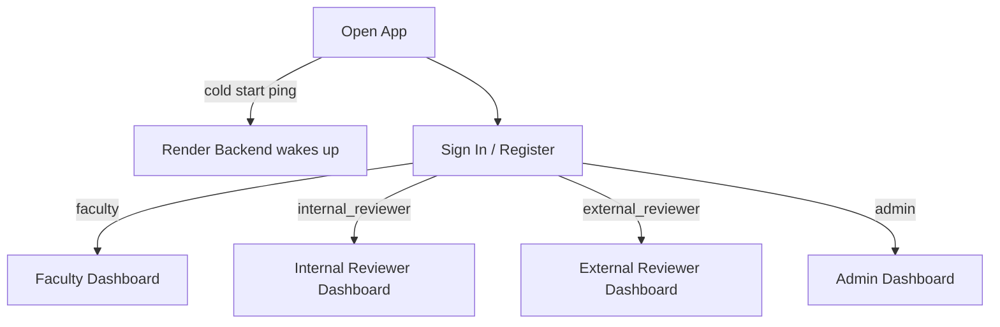
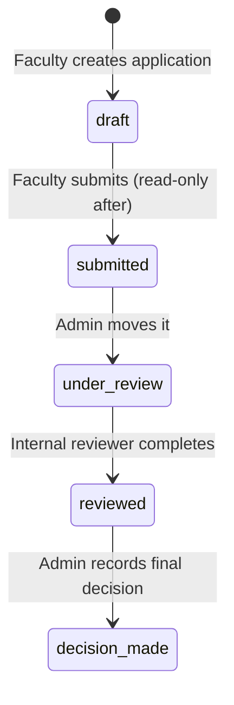

# FCPortal – Demo & Troubleshooting Guide

Live URL: **https://fcportal-569e5.web.app**  
Backend API: **https://portal-app-0wv4.onrender.com**

---

## Demo Accounts

All accounts are auto-created on first use. Just click the account tile on the sign-in screen and hit **Sign In** — no manual registration needed.

| Role | Email | Password |
|---|---|---|
| Faculty (Applicant) | `demo.faculty@fccollege.edu.pk` | `Demo@12345` |
| Internal Reviewer | `demo.internal@fccollege.edu.pk` | `Demo@12345` |
| External Reviewer | `demo.external@fccollege.edu.pk` | `Demo@12345` |
| Admin | `demo.admin@fccollege.edu.pk` | `Demo@12345` |

```
┌─────────────────────────────────────────────────────────────┐
│  Demo accounts — all use password: Demo@12345               │
│                                                             │
│  ┌──────────────────────┐  ┌──────────────────────────┐    │
│  │ Faculty         [Applicant]  │  │ Internal Reviewer  [Reviewer]│    │
│  │ demo.faculty@…               │  │ demo.internal@…              │    │
│  └──────────────────────┘  └──────────────────────────┘    │
│  ┌──────────────────────┐  ┌──────────────────────────┐    │
│  │ External Reviewer [External] │  │ Admin          [Admin]       │    │
│  │ demo.external@…              │  │ demo.admin@…                 │    │
│  └──────────────────────┘  └──────────────────────────┘    │
└─────────────────────────────────────────────────────────────┘
```

> **First-time only:** Render free tier sleeps when idle. The first sign-in after a period of inactivity may take ~30 seconds. The app silently pings the backend on load to minimise this.

---

## Demo Presenter Script

### Suggested order (15-minute walkthrough)

```
[1] Faculty → Create & Submit application     (5 min)
[2] Internal Reviewer → Review it             (3 min)
[3] External Reviewer → CV-only access        (2 min)
[4] Admin → Role management & overview        (3 min)
[5] Q&A                                       (2 min)
```

---

### Step 1 — Faculty (5 min)

1. Open **https://fcportal-569e5.web.app**
2. Click the **Faculty** tile → click **Sign In**
3. You land on the Faculty Dashboard:

```
┌──────────────────────────────────────────────────┐
│  FCPortal  │  Welcome, Demo Faculty              │
├──────────────────────────────────────────────────┤
│  ┌──────┐  ┌────────┐  ┌───────────┐  ┌──────┐  │
│  │Total │  │ Drafts │  │ Submitted │  │Revwd │  │
│  │  0   │  │   0    │  │     0     │  │  0   │  │
│  └──────┘  └────────┘  └───────────┘  └──────┘  │
│  [ + New Promotion ]  [ Contract Renewal ]       │
└──────────────────────────────────────────────────┘
```

4. Click **New Promotion Application**
5. Fill in **Personal Info** — name, CNIC, department
6. Point out: every step autosaves as a Draft; click **Save** to demonstrate
7. Go to **Publications** — add one publication, show the APA 7 reference auto-generating
8. Go to **Teaching Effectiveness** — show the rating/scoring system
9. Navigate to the last step **Declaration** — tick the checkbox → click **Submit**
10. Application is now read-only, status = **Submitted**

---

### Step 2 — Internal Reviewer (3 min)

1. Sign out → click the **Internal Reviewer** tile → **Sign In**
2. Dashboard shows the application just submitted:

```
┌──────────────────────────────────────────────────┐
│  SUBMITTED APPLICATIONS                          │
│  ┌────────────────────────────────────────────┐  │
│  │  Demo Faculty · Promotion     [SUBMITTED]  │  │
│  │  Computer Science · Just now   [ Review ]  │  │
│  └────────────────────────────────────────────┘  │
└──────────────────────────────────────────────────┘
```

3. Click **Review** → show section-by-section comment fields
4. Select overall recommendation: **Recommended**
5. Save the review

---

### Step 3 — External Reviewer (2 min)

1. Sign out → click the **External Reviewer** tile → **Sign In**
2. Point out: **only Full Professor applications are visible**, and only the CV
3. Explain: this is enforced by Firestore security rules — the reviewer literally cannot read other fields
4. Fill in the 3 narrative evaluation fields → select **Recommended**

---

### Step 4 — Admin (3 min)

1. Sign out → click the **Admin** tile → **Sign In**
2. Show the full application list with status badges
3. Open **User Management** → change a user's role using the dropdown

```
┌─────────────────────────────────────────────────────┐
│  USER MANAGEMENT                                    │
│  ┌───────────────────────────────────────────────┐  │
│  │ demo.faculty@…     faculty   [ Change Role ▼] │  │
│  │ demo.internal@…    internal  [ Change Role ▼] │  │
│  │ demo.external@…    external  [ Change Role ▼] │  │
│  │ demo.admin@…       admin     [ Change Role ▼] │  │
│  └───────────────────────────────────────────────┘  │
└─────────────────────────────────────────────────────┘
```

4. Show how the Admin can see all applications regardless of status

---



---

## Role Walkthroughs

### 1 — Faculty (Applicant)

**Register → Create → Submit**

```mermaid
graph LR
    REG[Register as Faculty] --> DASH[Faculty Dashboard]
    DASH --> NEW[New Promotion Application]
    NEW --> S1[Step 1: Personal Info]
    S1 --> S2[Step 2: Qualifications]
    S2 --> S3[Step 3: Experience]
    S3 --> S4[Step 4: Publications]
    S4 --> S5[Teaching Effectiveness]
    S5 --> S6[Efforts to Improve]
    S6 --> S7[Scholarship]
    S7 --> S8[Research Statement]
    S8 --> S9[Services]
    S9 --> S10[Documents]
    S10 --> S11[Declaration]
    S11 --> SUB[Submit]
```



**What you see as Faculty:**

```
┌──────────────────────────────────────────────────┐
│  FCPortal  │  Welcome, Alex                      │
├──────────────────────────────────────────────────┤
│                                                  │
│  ┌──────┐  ┌────────┐  ┌───────────┐  ┌──────┐  │
│  │Total │  │ Drafts │  │ Submitted │  │Revwd │  │
│  │  2   │  │   1    │  │     1     │  │  0   │  │
│  └──────┘  └────────┘  └───────────┘  └──────┘  │
│                                                  │
│  [ + New Promotion ]  [ Contract Renewal ]       │
│  [ Self-Evaluation ]                             │
│                                                  │
│  MY APPLICATIONS                                 │
│  ┌────────────────────────────────────────────┐  │
│  │  Associate Prof Promotion   [DRAFT]   >    │  │
│  │  Department not set · Created 02 May 2026  │  │
│  ├────────────────────────────────────────────┤  │
│  │  Contract Renewal           [SUBMITTED] >  │  │
│  │  CS Dept · Created 28 Apr 2026             │  │
│  └────────────────────────────────────────────┘  │
└──────────────────────────────────────────────────┘
```

**Demo steps:**
1. Go to the live URL, click **Register**
2. Enter name, email, password — leave role as **Faculty**
3. After sign-in you land on the Faculty Dashboard
4. Click **New Promotion Application**
5. Fill in Personal Info (minimum: Full Name, CNIC, Department)
6. Click **Save** at any step — autosaves a draft
7. Navigate to Publications → add an entry → APA reference generates automatically
8. On step **Declaration**, tick the checkbox → **Submit Application**
9. Application becomes read-only; status changes to **Submitted**

---

### 2 — Internal Reviewer

```
┌──────────────────────────────────────────────────┐
│  FCPortal  │  Internal Reviewer                  │
├──────────────────────────────────────────────────┤
│                                                  │
│  SUBMITTED APPLICATIONS                          │
│  ┌────────────────────────────────────────────┐  │
│  │  Jane Doe · Full Prof Promotion [SUBMITTED]│  │
│  │  Submitted 01 May 2026            [ Review]│  │
│  ├────────────────────────────────────────────┤  │
│  │  John Smith · Contract Renewal  [REVIEWED] │  │
│  │  Reviewed 30 Apr 2026          [View Form] │  │
│  └────────────────────────────────────────────┘  │
└──────────────────────────────────────────────────┘
```

**Demo steps:**
1. Register a second account — select role **Internal Reviewer**
2. Sign in → you land on the Internal Reviewer Dashboard
3. All submitted applications appear here
4. Click **Review** → fill section-by-section comments (max 200 words each)
5. Choose overall recommendation: `Strongly Recommended / Recommended / Conditionally / Not Recommended`
6. Save the review

---

### 3 — External Reviewer

```
┌──────────────────────────────────────────────────┐
│  FCPortal  │  External Reviewer                  │
├──────────────────────────────────────────────────┤
│                                                  │
│  You can only view Updated CVs for Full          │
│  Professor promotion applications.               │
│                                                  │
│  ┌────────────────────────────────────────────┐  │
│  │  Jane Doe · Full Prof Promotion            │  │
│  │  [ View CV ]  [ Write Evaluation ]         │  │
│  └────────────────────────────────────────────┘  │
└──────────────────────────────────────────────────┘
```

**Demo steps:**
1. Register as **External Reviewer**
2. Only Full Professor applications are visible — and only the CV
3. Write structured evaluation across 3 fields
4. Select `Recommended` or `Not Recommended`

---

### 4 — Admin

```
┌──────────────────────────────────────────────────┐
│  FCPortal  │  Admin                              │
├──────────────────────────────────────────────────┤
│                                                  │
│  [ Dashboard ]  [ User Management ]              │
│                                                  │
│  ALL APPLICATIONS                                │
│  ┌─────────────────────────────────────────────┐ │
│  │ Name        Type         Status     Action  │ │
│  │ Jane Doe    Promotion    Submitted  [View]   │ │
│  │ John Smith  Renewal      Draft      [View]   │ │
│  └─────────────────────────────────────────────┘ │
│                                                  │
│  USER MANAGEMENT                                 │
│  ┌─────────────────────────────────────────────┐ │
│  │ Email              Role      [Change Role]  │ │
│  │ jane@fcc.edu.pk    faculty   [▼]            │ │
│  │ bob@fcc.edu.pk     internal  [▼]            │ │
│  └─────────────────────────────────────────────┘ │
└──────────────────────────────────────────────────┘
```

**Demo steps:**
1. Register normally, then ask another admin to promote your role in User Management
   (or set `role: 'admin'` directly in Firestore under `users/{uid}`)
2. Admin Dashboard shows every application regardless of status
3. User Management lets you change any user's role (faculty / internal_reviewer / external_reviewer / admin)
4. Change application status manually (e.g. move from `submitted` → `under_review`)

---

## Application lifecycle



---

## Eligibility rules (auto-checked on submission)

```
Associate Professor              Full Professor
─────────────────────────────    ─────────────────────────────
✔ VET passed                     ✔ VET passed
✔ PhD required                   ✔ PhD required
✔ 10 yrs experience OR           ✔ 15 yrs experience OR
  5 yrs post-PhD                   10 yrs post-PhD
✔ 10 recognized publications     ✔ 15 recognized publications

Recognized indexing: HEC · Scopus · WoS · DOAJ · CNKI
```

---

## Troubleshooting

### "Failed to fetch" / blank dashboard on first load

Render free tier sleeps after 15 minutes. The app pings `/health` on startup to wake it, but the first sign-in after a sleep period may take ~30 seconds. **Wait and refresh.**

```
User opens app
      │
      ├─→ ping /health (background, wakes Render)
      │
      └─→ Sign In → token sent to Render
                         │
                    if 401 → frontend retries with fresh token automatically
                    if 500 → frontend falls back to direct Firestore read
```

### "Profile not found" on sign-in

Your Firebase Auth account has no Firestore profile document. The app auto-creates one on sign-in (role: faculty). If it still fails:
1. Open Firebase Console → Firestore → `users` collection
2. Check that a document exists with your UID
3. If not, sign out and sign in again — the bootstrap runs on every login

### 401 Unauthorized from backend

Almost always means `FIREBASE_SERVICE_ACCOUNT_JSON` on Render is wrong or missing.
- Must be from project `fcportal-569e5`
- `project_id` in the JSON must match
- After updating the env var, trigger a Render redeploy

### Firestore permission denied

Security rules are enforced by role. Common causes:
- You registered as `faculty` but are trying to access reviewer routes → normal, blocked by design
- Admin role not set → set it manually in Firestore `users/{uid}` → `role: "admin"`

### Backend still returning 500 on application routes

Check Render logs for the exact line. Common cause was `orderBy` + `where` requiring a composite index — already removed from the codebase. If you see a new index error, run:

```bash
npx firebase-tools deploy --only firestore --project fcportal-569e5
```

---

## Environment quick reference

| Variable | Where | Value |
|---|---|---|
| `FIREBASE_SERVICE_ACCOUNT_JSON` | Render env | Full JSON from Firebase Console → Service accounts |
| `FIREBASE_STORAGE_BUCKET` | Render env | `fcportal-569e5.firebasestorage.app` |
| `CORS_ORIGINS` | Render env | `https://fcportal-569e5.web.app,https://fcportal-569e5.firebaseapp.com` |
| `FIREBASE_TOKEN` | GitHub secret | From `npx firebase-tools login:ci` |

---

## Re-deploying

```bash
# Frontend only
npm run build
npx firebase-tools deploy --only hosting --project fcportal-569e5

# Firestore rules + indexes
npx firebase-tools deploy --only firestore --project fcportal-569e5

# Both at once
npx firebase-tools deploy --only hosting,firestore --project fcportal-569e5
```

Backend redeploy: push to `main` — Render auto-deploys on every push.
